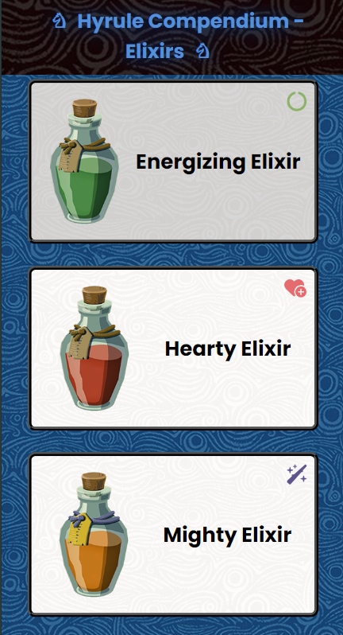

# Mini Hyrule Compendium - Elixirs

## ⌨️ Tech Stack
React / React Router / CSS / SASS / MirageJS / Node / npm / Vite 

## 🍼 Introduction
This project is a mini Hyrule Compendium where the user can view information about each potion. After reaching halfway through Bob Ziroll's Learn React Router course on Scrimba, I wanted to practice what I learnt so far. This includes implementing a template page to display the potion's information and experimenting with loaders. 
 
## 🛠️ Features
- Responsive design - Viewable on mobile, tablet and desktop
- Error path implemented if the information can't load and if users goes to a non-existing page
    - User is offered to go back to the homepage on a non-existing page
- Homepage uses loader to load all potion data
- Potion's information page uses useEffect hook with a loading state implemented to show data is being collected then displayed
- Accessibility - Implemented aria-labels where needed + used semantic HTML
- Back button on potion's information page to go back to homepage.
 
## 📚 Resources
- Organising SASS files - https://medium.com/@brunofrontend/practical-way-to-organize-your-sass-files-98c27a2623a2
- Scrimba's Learn React Router Course - https://v2.scrimba.com/learn-react-router-6-c06
- Mirage JS documentation - https://miragejs.com/ 

## 📝 Notes
All images used belong to Nintendo with intention to highlight the game and practice front-end skills.  
The images are from the Zelda Dungeon Wiki - https://www.zeldadungeon.net/wiki/Gallery:Tears_of_the_Kingdom_Elixirs.

Desktop Display|
| :--- |

 Tablet Display| |
| :--- | :--- |
 | 

 Phone Display| |
| :--- | :--- |
 | 

